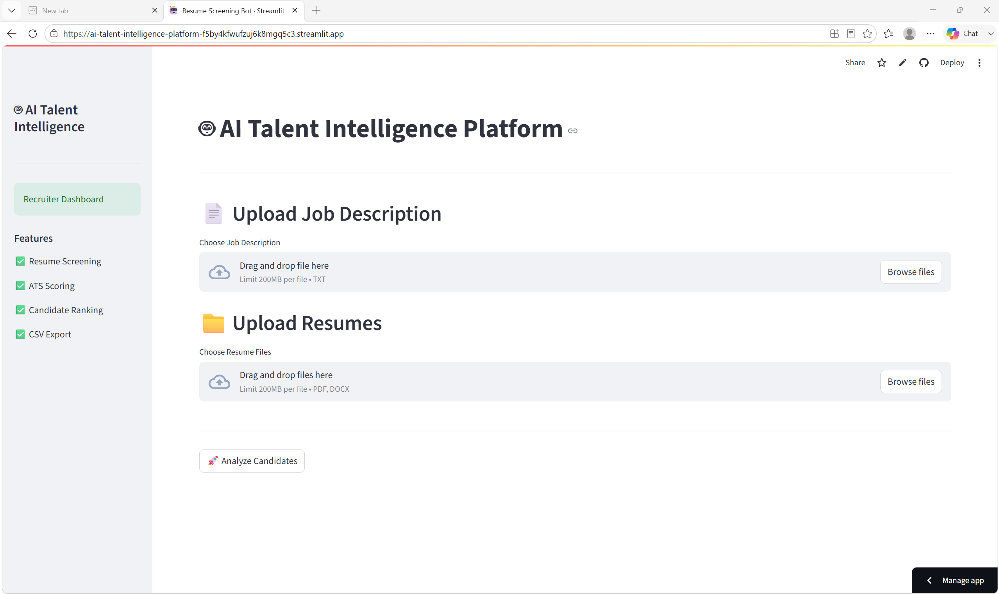
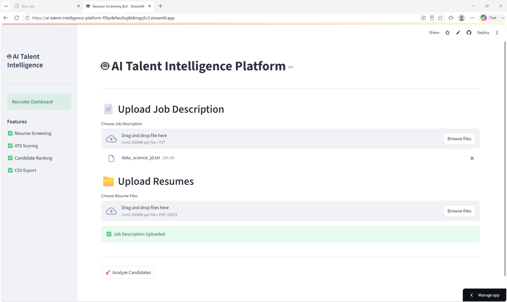
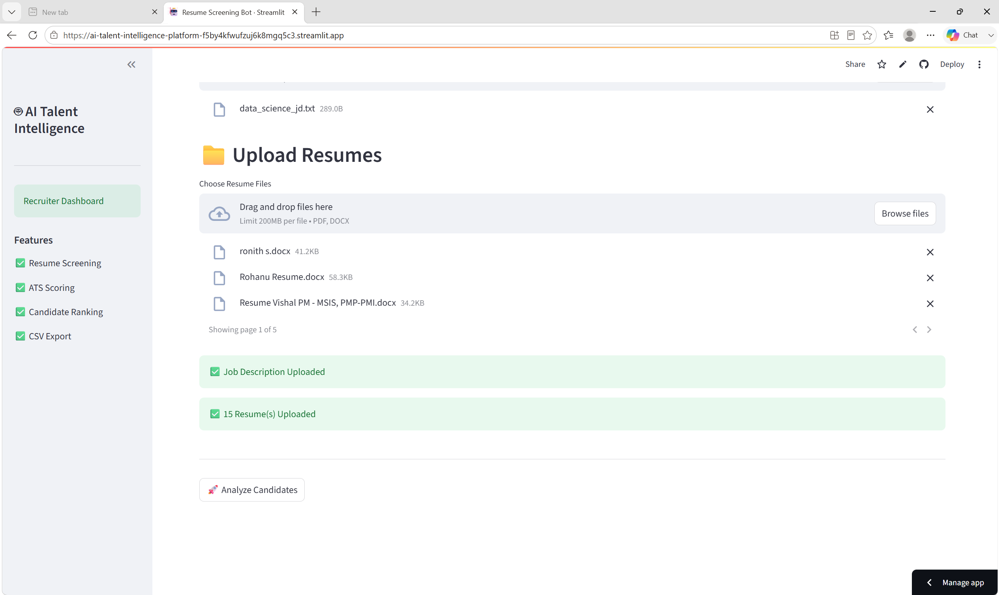
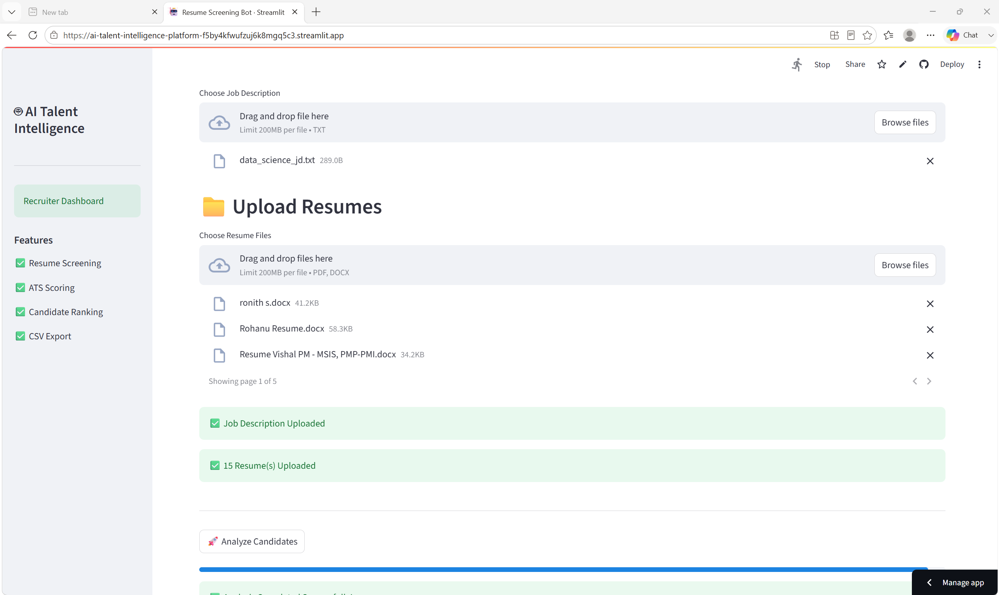
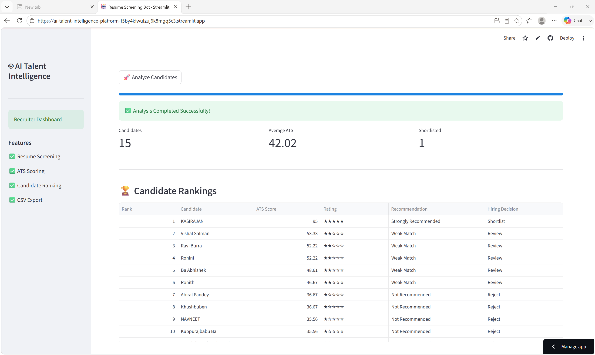
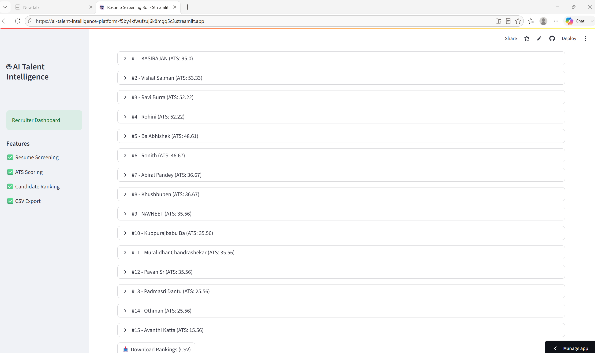

# 🚀 AI Talent Intelligence Platform

An AI-powered Resume Screening & ATS Scoring Platform that automates candidate evaluation by extracting resume information, matching skills with job descriptions, calculating ATS scores, and ranking candidates based on job fit.

This project helps recruiters save time by automatically identifying the most suitable candidates using Natural Language Processing (NLP) and Machine Learning techniques.

---

## 📌 Features

- 📄 Upload PDF and DOCX resumes
- 📝 Upload Job Description (JD)
- 👤 Extract Candidate Information
  - Name
  - Email
  - Phone Number
  - Education
  - Work Experience
- 🛠️ Automatic Technical Skill Extraction
- 🎯 Resume vs Job Description Skill Matching
- 📊 ATS Score Calculation
- ⭐ Hiring Recommendation
- 🏆 Automatic Candidate Ranking
- 📥 Export Results to CSV
- 🌐 Interactive Streamlit Web Application

---

## 🏗️ Project Architecture

```
Resume (PDF/DOCX)
        │
        ▼
 Resume Parser
        │
        ▼
 Text Cleaner
        │
        ▼
 Information Extractor
        │
 ┌──────┼────────┐
 │      │        │
 ▼      ▼        ▼
Skills Contact Education
        │
        ▼
 Job Description Parser
        │
        ▼
 Resume-JD Matcher
        │
        ▼
 ATS Scoring Engine
        │
        ▼
 Candidate Ranking
        │
        ▼
 CSV Report + Streamlit Dashboard
```

---

## 🛠️ Tech Stack

### Programming Language
- Python

### Frontend
- Streamlit

### Machine Learning & NLP
- Scikit-learn
- spaCy
- Sentence Transformers
- Transformers

### Resume Processing
- pdfplumber
- pdfminer.six
- python-docx
- docx2txt

### Data Processing
- Pandas
- NumPy

### Data Visualization
- Plotly

### Cloud Services
- AWS S3
- Boto3

### Other Libraries
- Requests
- Joblib
- Python Dotenv

---

## 📂 Project Structure

```
AI-Talent-Intelligence-Platform/
│
├── app.py
├── requirements.txt
├── README.md
│
├── backend/
│   ├── parser/
│   ├── extractor/
│   ├── matcher/
│   ├── scorer/
│   └── pipeline/
│
├── frontend/
│
├── data/
│   └── knowledge_base/
│
├── assets/
│
└── sample_files/
```

---

## ⚙️ Installation

Clone the repository

```bash
git clone https://github.com/Kasirajan93/AI-Talent-Intelligence-Platform.git
```

Go to the project directory

```bash
cd AI-Talent-Intelligence-Platform
```

Install dependencies

```bash
pip install -r requirements.txt
```

Run the application

```bash
streamlit run app.py
```

---

## 🚀 How to Use

1. Launch the Streamlit application.
2. Upload a Job Description (.txt).
3. Upload one or more resumes (PDF/DOCX).
4. Click **Analyze**.
5. View ATS scores, matched skills, missing skills, and candidate rankings.
6. Download the screening report as a CSV file.

---

## 📊 Output

The application provides:

- Candidate Information
- Contact Details
- Technical Skills
- Education Details
- Experience Summary
- Matched Skills
- Missing Skills
- Resume Match Percentage
- ATS Score
- Hiring Recommendation
- Candidate Ranking
- Downloadable CSV Report

---

## 📸 Screenshots

### 🏠 Dashboard



---

### 📄 Upload Job Description



---

### 📄 Upload Resume(s)



---

### 🤖 Resume Analysis



---

### 🏆 Candidate Rankings



---

### 📥 Download CSV Report



## 🔮 Future Enhancements

- AI-generated Candidate Summary
- Semantic Resume Matching
- OCR Support for Scanned Resumes
- Recruiter Dashboard
- Email Notification System
- Multi-language Resume Support
- LLM-powered Interview Question Generator

---

## 💡 Key Highlights

- Automated Resume Parsing
- Intelligent Skill Extraction
- ATS-Based Resume Evaluation
- Resume vs JD Matching
- Candidate Ranking
- Interactive Dashboard
- Recruiter-Friendly Workflow

---

## 👨‍💻 Author

**Kasi Rajan**

Former Ayurvedic Doctor | Data Science & AI Enthusiast

### Connect with Me

**GitHub**

https://github.com/Kasirajan93

**LinkedIn**

https://linkedin.com/in/kasi-rajan-488005349

---

## ⭐ Support

If you found this project useful, please consider giving it a ⭐ on GitHub.

---

## 📄 License

This project is licensed under the MIT License.